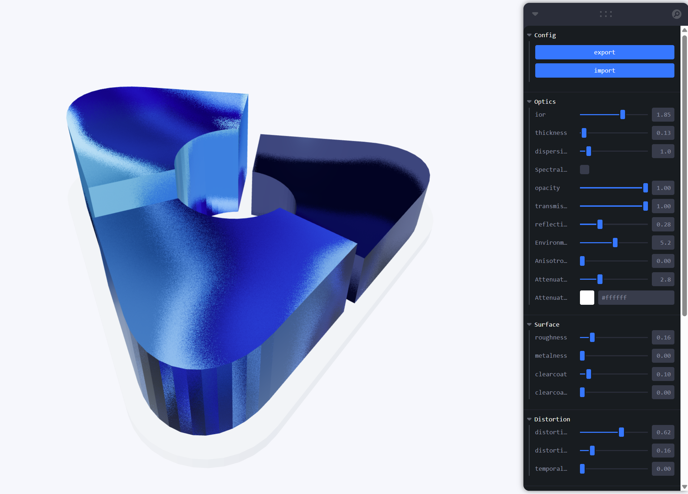

# First Experiment Week – Shading 3D Model

In the week of 7th september, we had a experiment week where everyone chooses experiments to work on. For this experiment week I chose to work on **Shading 3d model**.

Everyone worked on different parts in this experiment to come to a desired result of the 3D model, some worked on a moodboard as reference, making the desired 3d model with effect in blender, or to realise it in code. I went for programming it.

Using react with packages like, drei, threejs, fiber, leva I set up a environment where you can test and see live results on the model because of leva. It was a really cool experiment where I got to learn new packages. Sadly there were some bugs in my set up, so we couldn't reach the desired result with my result. However, a colleague did reach the result with exact same set up 👍

## Tech stack

- [React](https://react.dev/)
- [Three.js](https://threejs.org/)
- [React Three Fiber](https://r3f.docs.pmnd.rs/)
- [Drei](https://drei.docs.pmnd.rs/)
- [Leva](https://github.com/pmndrs/leva)

## Result

See image of my result below:

## Sources

- [Drei – MeshTransmissionMaterial](https://drei.docs.pmnd.rs/shaders/mesh-transmission-material)
- [Three.js – MeshPhysicalMaterial](https://threejs.org/docs/#MeshPhysicalMaterial)
- [React Three Fiber – Introduction](https://r3f.docs.pmnd.rs/getting-started/introduction)
- [Leva – Three.js Resources](https://threejsresources.com/tool/leva)
